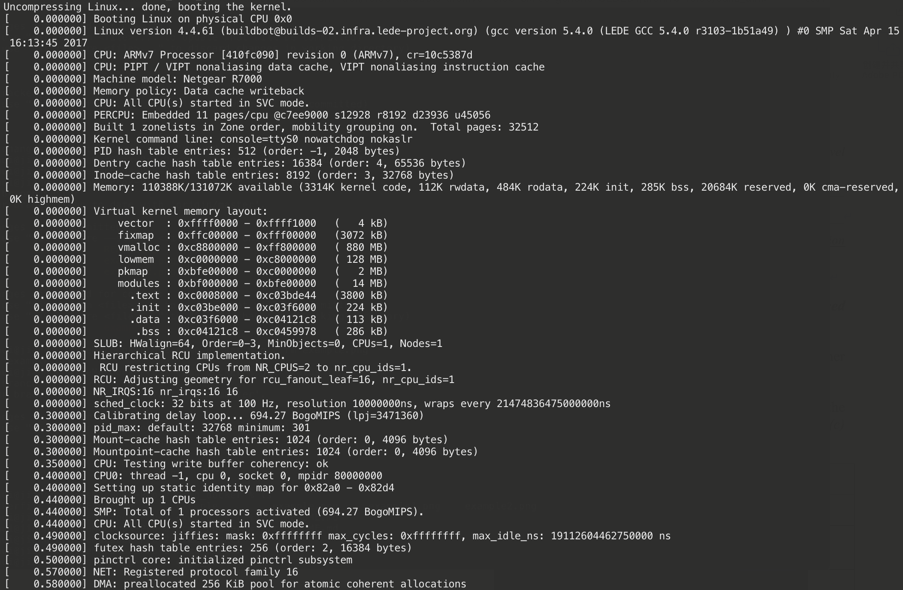
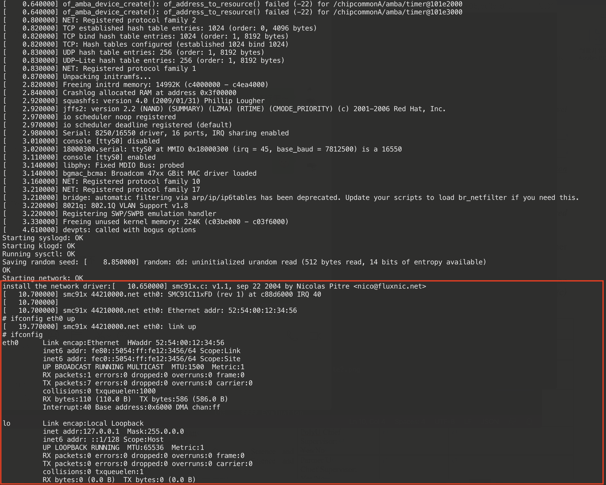

# Supplementary Material 
This repository is used to our paper submitted to CCS'21. We release a Docker image that contains the ECMO system for a test run.

## Usage 
### Build and enter the Docker
```
git clone https://github.com/anonymous-researcher22/ecmo_docker.git
cd ecmo_docker
docker build -t your-docker-name:latest .
docker run --rm -it your-docker-name:latest /bin/bash
```

### Boot the example kernel
```
./bcm_4_4_61.sh
```
The username is root and no password is required.

The Kernel is rehosted successfully with the printed log

The network device (SMC91X) can work successfully by injecting kernel module

